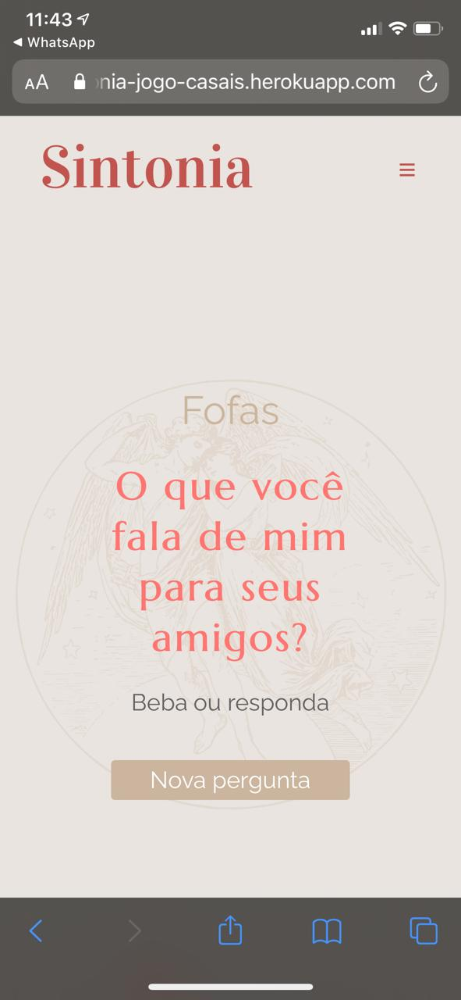
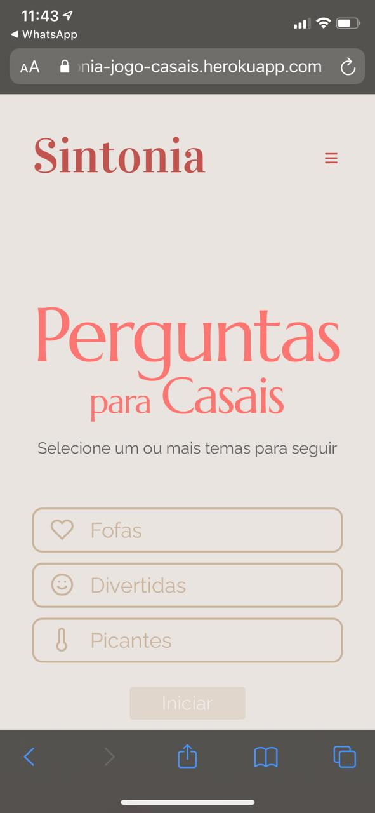
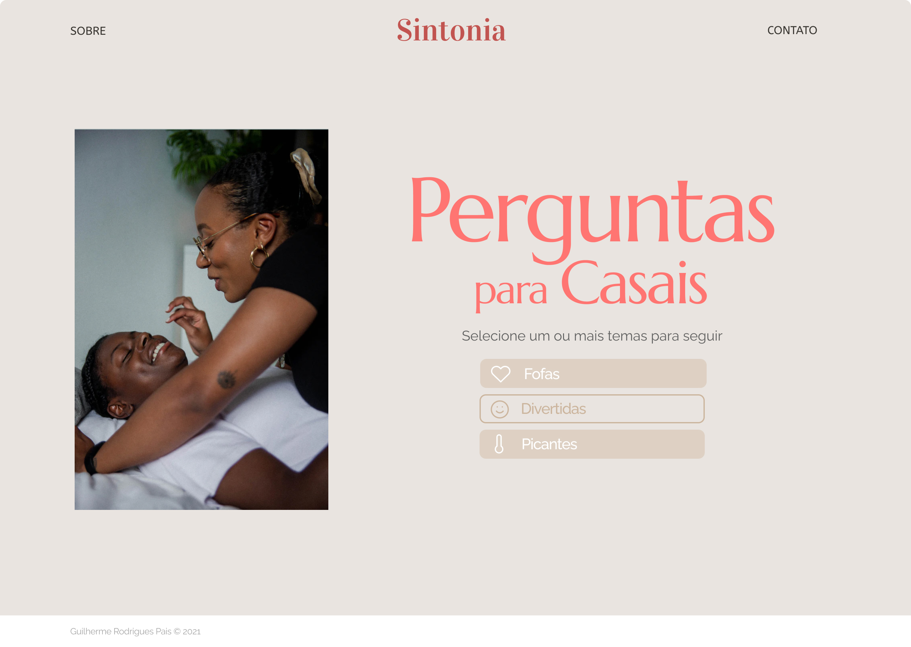
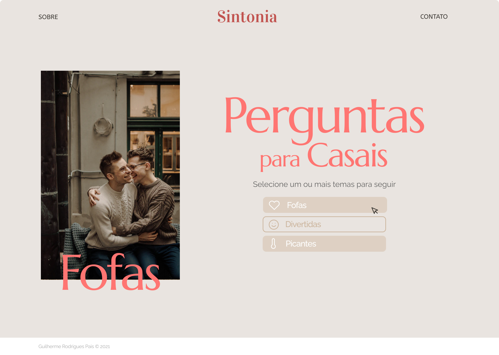
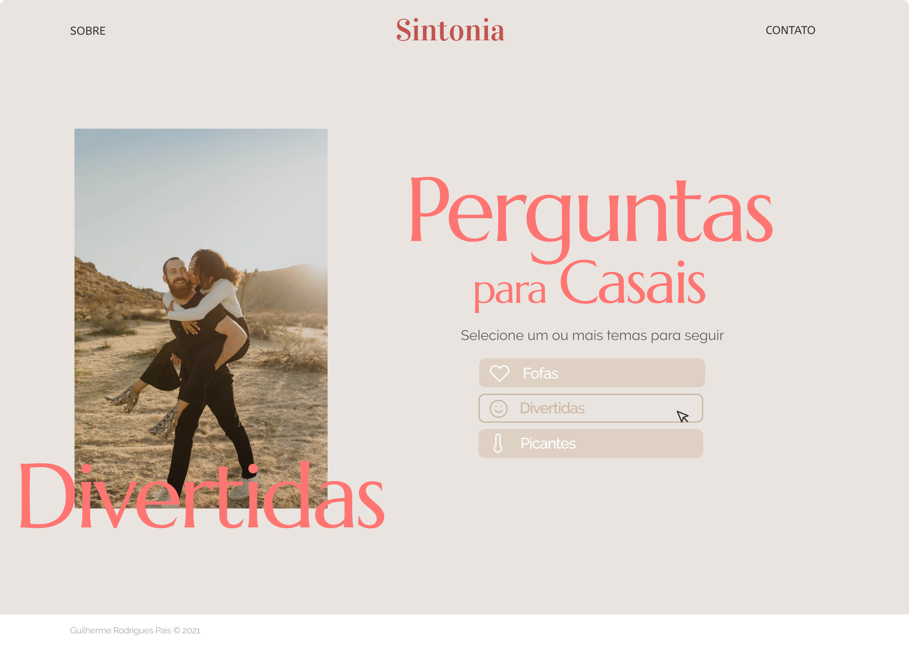
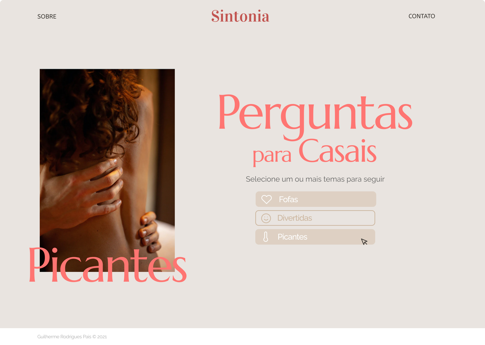

<h1 align="center">
     💌 <a href="#" alt="site do ecoleta"> Sintonia </a>
</h1>

<h3 align="center">
    💘 O Jogo de perguntas para animar a noite do casal. 💋
</h3>

<h4 align="center">
	🚧   Concluído 🚀 🚧
</h4>

# Tabela de conteúdos

<!--ts-->

- [Sobre o projeto](#-sobre-o-projeto)
- [Funcionalidades](#-funcionalidades)
- [Layout](#-layout)
  - [Mobile](#mobile)
  - [Web](#web)
- [Como executar o projeto](#-como-executar-o-projeto)
  - [Pré-requisitos](#pré-requisitos)
  - [Rodando o Backend (servidor)](#user-content--rodando-o-backend-servidor)
  - [Rodando a aplicação web (Frontend)](#user-content--rodando-a-aplicação-web-frontend)
- [Tecnologias](#-tecnologias)
  - [WebSite](#user-content-website--react----typescript)
  - [Server](#user-content-server--nodejs----typescript)
  - [Mobile](#user-content-mobile--react-native----typescript)
- [Contribuidores](#-contribuidores)
- [Como contribuir no projeto](#-como-contribuir-no-projeto)
- [Autor](#-autor)
- [Licença](#user-content--licença)
<!--te-->

## 💻 Sobre o projeto

❗ O jogo Sintonia foi criado para ajudar casais nos momentos de ócio, ou apenas para ter uma noite um pouco mais animada. Com o jogo Sintonia espera-se que os casais se conheçam melhor, discutam pontos importantes das suas vidas ou apenas quebre o gelo para uma noite mais leve. Jogo Indicado para casais recentes ou para casais de longa data, aproveitem :)
- 🔗 Vem ver o [jogo](https://sintonia-jogo-casais.herokuapp.com/) rodando! 

## Projeto desenvolvido para fins não profissionais.

## ⚙️ Funcionalidades

- [x] Selecionar um ou mais temas de perguntas:

  - [x] Fofas
  - [x] Divertidas
  - [x] Picantes

- [x] Navegar por páginas:

  - [x] Home
  - [x] Quiz
  - [x] Sobre
  - [x] Contato

- [x] Visualizar de forma randômica as perguntas para os temas selecionados:

  - [x] Solicitar nova pergunta Randômica
  - [ ] Definir nome dos jogadores

- [x] Versão Responsiva simplificada

---

## 🎨 Layout

O layout da aplicação foi desenvolvido no Figma.

### Mobile

<p align="center">
  
  
</p>

### Web

<p align="center" style="display: flex; align-items: flex-start; justify-content: center;">
  <br>
  
  
  
</p>


#### 🧭 Rodando a aplicação web (Frontend)

```bash

# Clone este repositório
$ git clone git@github.com:guilhermerodpais/sintonia-jogo-casais.git

# Acesse a pasta do projeto no seu terminal/cmd
$ cd sintonia-jogo-casais

# Instale as dependências
$ yarn

# Execute a aplicação em modo de desenvolvimento
$ yarn start

# A aplicação será aberta na porta:3000 - acesse http://localhost:3000

```

---

## 🛠 Tecnologias

As seguintes ferramentas foram usadas na construção do projeto:

#### **Website** ([React](https://reactjs.org/) + [TypeScript](https://www.typescriptlang.org/))

- **[React Router Dom](https://github.com/ReactTraining/react-router/tree/master/packages/react-router-dom)**

## 🦸 Autor

<a href="https://guilhermerodpais.github.io/guilhermerodpais/">
 
 <br />
 <sub><b>Guilherme pais</b></sub></a> <a href="https://guilhermerodpais.github.io/guilhermerodpais/" title="GLRMP">🚀</a>
 <br />

[](https://www.linkedin.com/in/guilhermepais)
[](mailto:guilhermepais2013@gmail.com)
[](https://t.me/guilhermerodpais)
---
